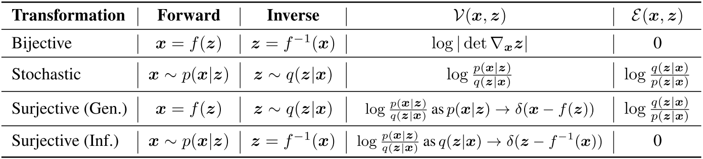

# SurVAE Flows

Official code for [SurVAE Flows: Surjections to Bridge the Gap between VAEs and Flows](https://arxiv.org/abs/2007.02731)  
by Didrik Nielsen, Priyank Jaini, Emiel Hoogeboom, Ole Winther, Max Welling.

Composable building blocks of SurVAE flows include:  
* **Bijective:** Invertible deterministic transformations. The usual building blocks in normalizing flows.
* **Stochastic:** Stochastic transformations with stochastic inverses. VAEs are an important example.
* **Surjective (Gen.):** Generative surjections are deterministic in the generative direction with a stochastic right-inverse in the inference direction.
* **Surjective (Inf.):** Inference surjections are deterministic in the inference direction with a stochastic right-inverse in the generative direction.

  



The code to reproduce the experiments in the paper can be found in the `/experiments/` folder.  
The experiment code depends on the SurVAE library, described below.

## The SurVAE Library


The SurVAE library is a Python package, built on top of [PyTorch](https://pytorch.org/).  
The SurVAE library allows straightforward construction of SurVAE flows.

See `/examples/` for runnable examples.  
See bottom for installation instructions.

#### Example 1: Normalizing Flow

We can construct a simple *normalizing flow* for 2d data by stacking 4 coupling layers.

```python
import torch.nn as nn
from survae.flows import Flow
from survae.distributions import StandardNormal
from survae.transforms import AdditiveCouplingBijection, ActNormBijection, Reverse

def net():
  return nn.Sequential(nn.Linear(1, 200), nn.ReLU(),
                       nn.Linear(200, 100), nn.ReLU(),
                       nn.Linear(100, 1))

model = Flow(base_dist=StandardNormal((2,)),
             transforms=[
               AdditiveCouplingBijection(net()), ActNormBijection(2), Reverse(2),
               AdditiveCouplingBijection(net()), ActNormBijection(2), Reverse(2),
               AdditiveCouplingBijection(net()), ActNormBijection(2), Reverse(2),
               AdditiveCouplingBijection(net()), ActNormBijection(2),
             ])
```

#### Example 2: Augmented Normalizing Flow

To turn this into an *augmented normalizing flow*, we simply add `Augment` as the first layer and adjust the dimensions. `Augment` corresponds to a generative slicing operation.

```python
import torch.nn as nn
from survae.flows import Flow
from survae.distributions import StandardNormal
from survae.transforms import Augment, AdditiveCouplingBijection, ActNormBijection, Reverse

def net():
  return nn.Sequential(nn.Linear(2, 200), nn.ReLU(),
                       nn.Linear(200, 100), nn.ReLU(),
                       nn.Linear(100, 2))

model = Flow(base_dist=StandardNormal((4,)),
             transforms=[
               Augment(StandardNormal((2,)), x_size=2),
               AdditiveCouplingBijection(net()), ActNormBijection(4), Reverse(4),
               AdditiveCouplingBijection(net()), ActNormBijection(4), Reverse(4),
               AdditiveCouplingBijection(net()), ActNormBijection(4), Reverse(4),
               AdditiveCouplingBijection(net()), ActNormBijection(4),
             ])
```

#### Example 3: Hierarchical VAE
We may also use a sequence of stochastic transformations, corresponding to a *hierarchical VAE* with 4 stochastic layers.

```python
import torch.nn as nn
from survae.flows import Flow
from survae.distributions import StandardNormal, ConditionalNormal
from survae.transforms import VAE

def net():
  return nn.Sequential(nn.Linear(2, 200), nn.ReLU(),
                       nn.Linear(200, 100), nn.ReLU(),
                       nn.Linear(100, 4))

model = Flow(base_dist=StandardNormal((2,)),
             transforms=[
               VAE(encoder=ConditionalNormal(net()), decoder=ConditionalNormal(net())),
               VAE(encoder=ConditionalNormal(net()), decoder=ConditionalNormal(net())),
               VAE(encoder=ConditionalNormal(net()), decoder=ConditionalNormal(net())),
               VAE(encoder=ConditionalNormal(net()), decoder=ConditionalNormal(net())),
             ])
```

#### Example 4: Multi-scale augmented flow

Here is an example of a multi-scale convolutional augmented flow for (3,32,32) images such as CIFAR-10.  
Notice that this makes use of 3 types of surjective layers:
1. **Generative rounding:** Implemented using `UniformDequantization`. Allows conversion to continuous variables. Useful for training continuous flows on ordinal discrete data.
1. **Generative slicing:** Implemented using `Augment`. Allows increasing dimensionality towards the latent space. Useful for constructing augmented normalizing flows.
1. **Inference slicing:** Implemented using `Slice`. Allows decreasing dimensionality towards the latent space. Useful for constructing multi-scale architectures.

```python
import torch.nn as nn
from survae.flows import Flow
from survae.distributions import StandardNormal, StandardUniform
from survae.transforms import AffineCouplingBijection, ActNormBijection2d, Conv1x1
from survae.transforms import UniformDequantization, Augment, Squeeze2d, Slice
from survae.nn.layers import ElementwiseParams2d
from survae.nn.nets import DenseNet

def net(channels):
  return nn.Sequential(DenseNet(in_channels=channels//2,
                                out_channels=channels,
                                num_blocks=1,
                                mid_channels=64,
                                depth=8,
                                growth=16,
                                dropout=0.0,
                                gated_conv=True,
                                zero_init=True),
                        ElementwiseParams2d(2))

model = Flow(base_dist=StandardNormal((24,8,8)),
             transforms=[
               UniformDequantization(num_bits=8),
               Augment(StandardUniform((3,32,32)), x_size=3),
               AffineCouplingBijection(net(6)), ActNormBijection2d(6), Conv1x1(6),
               AffineCouplingBijection(net(6)), ActNormBijection2d(6), Conv1x1(6),
               AffineCouplingBijection(net(6)), ActNormBijection2d(6), Conv1x1(6),
               AffineCouplingBijection(net(6)), ActNormBijection2d(6), Conv1x1(6),
               Squeeze2d(), Slice(StandardNormal((12,16,16)), num_keep=12),
               AffineCouplingBijection(net(12)), ActNormBijection2d(12), Conv1x1(12),
               AffineCouplingBijection(net(12)), ActNormBijection2d(12), Conv1x1(12),
               AffineCouplingBijection(net(12)), ActNormBijection2d(12), Conv1x1(12),
               AffineCouplingBijection(net(12)), ActNormBijection2d(12), Conv1x1(12),
               Squeeze2d(), Slice(StandardNormal((24,8,8)), num_keep=24),
               AffineCouplingBijection(net(24)), ActNormBijection2d(24), Conv1x1(24),
               AffineCouplingBijection(net(24)), ActNormBijection2d(24), Conv1x1(24),
               AffineCouplingBijection(net(24)), ActNormBijection2d(24), Conv1x1(24),
               AffineCouplingBijection(net(24)), ActNormBijection2d(24), Conv1x1(24),
             ])
```


#### Acknowledgements

This code base builds on several other repositories. The biggest sources of inspiration are:

* https://github.com/bayesiains/nsf
* https://github.com/pclucas14/pytorch-glow
* https://github.com/karpathy/pytorch-made

Thanks to the authors of these and the many other useful repositories!


#### Installation

In the folder containing `setup.py`, run
```
pip install --user -e .
```
The `--user` option ensures the library will only be installed for your user.  
The `-e` option makes it possible to modify the library, and modifications will be loaded on the fly.

You should now be able to use it.
