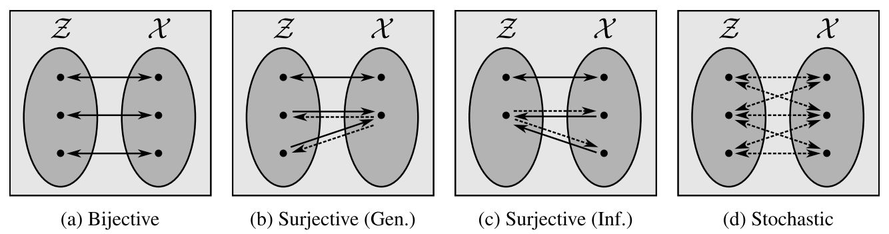

# SurVAE Flows

> Official code for [SurVAE Flows: Surjections to Bridge the Gap between VAEs and Flows](https://arxiv.org/abs/2007.02731)  
by Didrik Nielsen, Priyank Jaini, Emiel Hoogeboom, Ole Winther, Max Welling.

SurVAE Flows is a framework of composable transformations that extends the framework of normalizing flows.  
SurVAE Flows make use of not only **bijective** transformations, but also **surjective** and **stochastic** transformations.  
For more details, see the [paper](https://arxiv.org/abs/2007.02731) or check out this [talk](https://www.youtube.com/watch?v=bXp8fk4MRXQ) by Max Welling.

  

<!-- Composable building blocks of SurVAE flows include:  
* **Bijective:** Invertible deterministic transformations. The usual building blocks in normalizing flows.
* **Stochastic:** Stochastic transformations with stochastic inverses. VAEs are an important example.
* **Surjective (Gen.):** Deterministic transformations in the generative direction with a stochastic right-inverse in the inference direction.
* **Surjective (Inf.):** Deterministic transformations in the inference direction with a stochastic right-inverse in the generative direction.


For more details, see [the paper](https://arxiv.org/abs/2007.02731) or check out this talk by Max Welling:  
[](https://www.youtube.com/watch?v=bXp8fk4MRXQ) -->

## Contents

* `/survae/`: Code for the SurVAE library. See description below.
* `/examples/`: Runnable examples using the SurVAE library.
* `/experiments/`: Code to reproduce the experiments in the paper.

**Pretrained models** can be downloaded from [releases](https://github.com/didriknielsen/survae_flows/releases/tag/v1.0.0).

## The SurVAE Library


The SurVAE library is a Python package, built on top of [PyTorch](https://pytorch.org/).  
The SurVAE library allows straightforward construction of SurVAE flows.

#### Installation

In the folder containing `setup.py`, run
```
pip install .
```

#### Example 1: Normalizing Flow

We can construct a simple *normalizing flow* by stacking **bijective transformations**.  
In this case, we model 2d data using a flow of 4 affine coupling layers.

```python
import torch.nn as nn
from survae.flows import Flow
from survae.distributions import StandardNormal
from survae.transforms import AffineCouplingBijection, ActNormBijection, Reverse
from survae.nn.layers import ElementwiseParams

def net():
  return nn.Sequential(nn.Linear(1, 200), nn.ReLU(),
                       nn.Linear(200, 100), nn.ReLU(),
                       nn.Linear(100, 2), ElementwiseParams(2))

model = Flow(base_dist=StandardNormal((2,)),
             transforms=[
               AffineCouplingBijection(net()), ActNormBijection(2), Reverse(2),
               AffineCouplingBijection(net()), ActNormBijection(2), Reverse(2),
               AffineCouplingBijection(net()), ActNormBijection(2), Reverse(2),
               AffineCouplingBijection(net()), ActNormBijection(2),
             ])
```
See [here](https://github.com/didriknielsen/survae_flows/blob/master/examples/toy_flow.py) for a runnable example.

#### Example 2: VAE

We can further build *VAEs* using **stochastic transformations**.  
We here construct a simple VAE for binary images of shape (1,28,28), such as binarized MNIST.  
We can easily extend this simple VAE by adding more layers to obtain e.g. hierarchical VAEs or VAEs with flow priors.  
We can also use conditional flows in the encoder and/or decoder to obtain a more expressive VAE transformation.

```python
from survae.flows import Flow
from survae.transforms import VAE
from survae.distributions import StandardNormal, ConditionalNormal, ConditionalBernoulli
from survae.nn.nets import MLP

encoder = ConditionalNormal(MLP(784, 2*latent_size,
                                hidden_units=[512,256],
                                activation='relu',
                                in_lambda=lambda x: 2 * x.view(x.shape[0], 784).float() - 1))
decoder = ConditionalBernoulli(MLP(latent_size, 784,
                                   hidden_units=[512,256],
                                   activation='relu',
                                   out_lambda=lambda x: x.view(x.shape[0], 1, 28, 28)))

model = Flow(base_dist=StandardNormal((latent_size,)),
             transforms=[
                VAE(encoder=encoder, decoder=decoder)
             ])
```
See [here](https://github.com/didriknielsen/survae_flows/blob/master/examples/mnist_vae.py) for a runnable example.

#### Example 3: Multi-Scale Augmented Flow

We can implement e.g. dequantization, augmentation and multi-scale flows using **surjective transformations**.  
Here, we use these layers in a *multi-scale augmented flow* for (3,32,32) images such as CIFAR-10.  

Notice that this makes use of 3 types of surjective layers:
1. **Generative rounding:** Implemented using `UniformDequantization`. Allows conversion to continuous variables. Useful for training continuous flows on ordinal discrete data.
1. **Generative slicing:** Implemented using `Augment`. Allows increasing dimensionality towards the latent space. Useful for constructing augmented normalizing flows.
1. **Inference slicing:** Implemented using `Slice`. Allows decreasing dimensionality towards the latent space. Useful for constructing multi-scale architectures.


```python
import torch.nn as nn
from survae.flows import Flow
from survae.distributions import StandardNormal, StandardUniform
from survae.transforms import AffineCouplingBijection, ActNormBijection2d, Conv1x1
from survae.transforms import UniformDequantization, Augment, Squeeze2d, Slice
from survae.nn.layers import ElementwiseParams2d
from survae.nn.nets import DenseNet

def net(channels):
  return nn.Sequential(DenseNet(in_channels=channels//2,
                                out_channels=channels,
                                num_blocks=1,
                                mid_channels=64,
                                depth=8,
                                growth=16,
                                dropout=0.0,
                                gated_conv=True,
                                zero_init=True),
                        ElementwiseParams2d(2))

model = Flow(base_dist=StandardNormal((24,8,8)),
             transforms=[
               UniformDequantization(num_bits=8),
               Augment(StandardUniform((3,32,32)), x_size=3),
               AffineCouplingBijection(net(6)), ActNormBijection2d(6), Conv1x1(6),
               AffineCouplingBijection(net(6)), ActNormBijection2d(6), Conv1x1(6),
               AffineCouplingBijection(net(6)), ActNormBijection2d(6), Conv1x1(6),
               AffineCouplingBijection(net(6)), ActNormBijection2d(6), Conv1x1(6),
               Squeeze2d(), Slice(StandardNormal((12,16,16)), num_keep=12),
               AffineCouplingBijection(net(12)), ActNormBijection2d(12), Conv1x1(12),
               AffineCouplingBijection(net(12)), ActNormBijection2d(12), Conv1x1(12),
               AffineCouplingBijection(net(12)), ActNormBijection2d(12), Conv1x1(12),
               AffineCouplingBijection(net(12)), ActNormBijection2d(12), Conv1x1(12),
               Squeeze2d(), Slice(StandardNormal((24,8,8)), num_keep=24),
               AffineCouplingBijection(net(24)), ActNormBijection2d(24), Conv1x1(24),
               AffineCouplingBijection(net(24)), ActNormBijection2d(24), Conv1x1(24),
               AffineCouplingBijection(net(24)), ActNormBijection2d(24), Conv1x1(24),
               AffineCouplingBijection(net(24)), ActNormBijection2d(24), Conv1x1(24),
             ])
```
See [here](https://github.com/didriknielsen/survae_flows/blob/master/examples/cifar10_aug_flow.py) for a runnable example.


#### Acknowledgements

This code base builds on several other repositories. The biggest sources of inspiration are:

* https://github.com/bayesiains/nsf
* https://github.com/pclucas14/pytorch-glow
* https://github.com/karpathy/pytorch-made

Thanks to the authors of these and the many other useful repositories!
