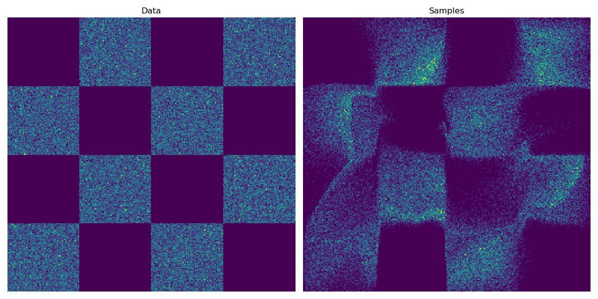
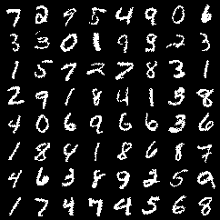
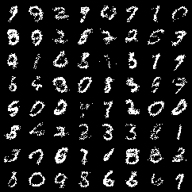
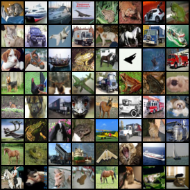
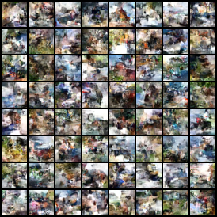

# Examples

Below you find a description of the current examples.  
More examples will be added!  

## `toy_flow.py`

A normalizing flow consisting of 4 coupling layers is trained on 2d toy data.   
In less than 2 minutes of training on CPU, you get a result like this:

  

## `mnist_vae.py` & `mnist_hvae.py`

* `mnist_vae.py`: A simple VAE on binarized MNIST.
* `mnist_hvae.py`: A simple hierarchical VAE on binarized MNIST (using 2 stochastic layers).  

In less than 2 minutes of training on CPU/GPU, you get samples like this:

 

**Left:** *Data*, **Right:** *Samples*.

This model was trained for only 20 epochs and uses only simple MLPs in the encoder and decoder.  
Longer training, larger models and/or convolutional neural networks would likely increase the performance.

## `cifar10_aug_flow.py`

A multi-scale augmented flow on CIFAR-10.  
In less than 2 hours of training on a Titan X (Pascal) GPU, you get a model with test set performance of **3.79 bits/dim** and samples like this:

 

**Left:** *Data*, **Right:** *Samples*.

This model was only trained for 10 epochs. Furthermore, the model used only 12 coupling layers with medium-sized DenseNets and uniform dequantization.  
Longer training, variational dequantization, as well as more flow layers with larger DenseNets and regularization, would likely increase the performance.
