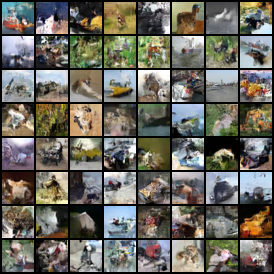
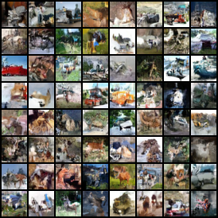
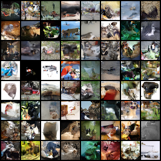
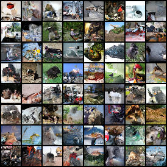
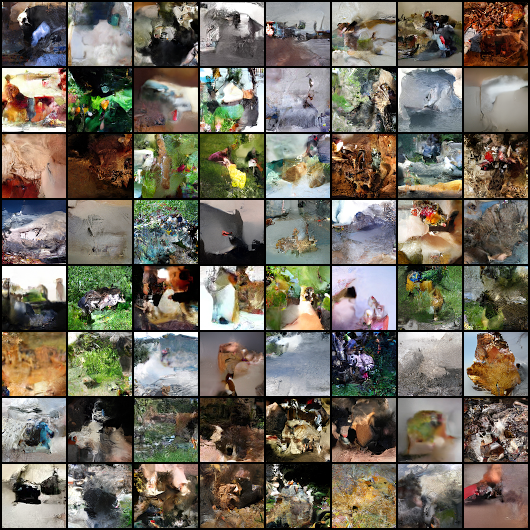
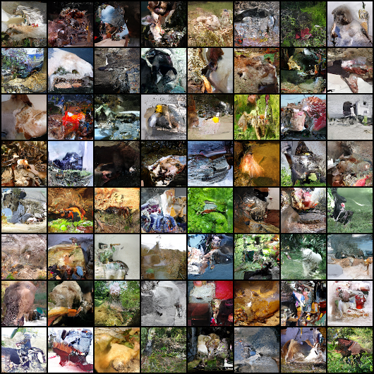

# Image Experiments

We compare flow models trained on image data using either a max pooling surjection or tensor slicing surjection for downsampling. Note that tensor slicing gives rise to the commonly-used multi-scale architecture and is therefore used as a baseline.

Pretrained model checkpoints can be downloaded from [releases](https://github.com/didriknielsen/survae_flows/releases/tag/v1.0.0).

Below, we show some samples from the trained models:  
**Left:** *MaxPoolFlow*, **Right:** *Baseline*.  
**Top:** *CIFAR-10*, **Middle:** *ImageNet 32x32*, **Bottom:** *ImageNet 64x64*.

 

 

 

## Training

We train the models in 2 phases:
1. **Main training:** Train the models for a long time with a decaying learning rate.
1. **Cooldown period:** The model is trained for some additional epochs using a smaller (constant) learning rate.

#### CIFAR-10
Main training:
```python
python train.py --epochs 500 --batch_size 32 --optimizer adamax --lr 1e-3 --gamma 0.995 --eval_every 1 --check_every 10 --warmup 5000 --num_steps 12 --num_scales 2 --dequant flow --pooling max --dataset cifar10 --augmentation eta --name maxpool
python train.py --epochs 500 --batch_size 32 --optimizer adamax --lr 1e-3 --gamma 0.995 --eval_every 1 --check_every 10 --warmup 5000 --num_steps 12 --num_scales 2 --dequant flow --pooling none --dataset cifar10 --augmentation eta --name nonpool
```
Cooldown period:
```python
python train_more.py --new_epochs 550 --new_lr 2e-5 --model /home/didni/log/cifar10_8bit/pool_flow/expdecay/maxpool --name maxpool
python train_more.py --new_epochs 550 --new_lr 2e-5 --model /home/didni/log/cifar10_8bit/pool_flow/expdecay/nonpool --name nonpool
```

#### ImageNet 32x32
Main training:
```python
python train.py --epochs 25 --batch_size 32 --optimizer adamax --lr 1e-3 --gamma 0.95 --eval_every 1 --check_every 1 --warmup 5000 --num_steps 12 --num_scales 2 --dequant flow --pooling max --dataset imagenet32 --name maxpool
python train.py --epochs 25 --batch_size 32 --optimizer adamax --lr 1e-3 --gamma 0.95 --eval_every 1 --check_every 1 --warmup 5000 --num_steps 12 --num_scales 2 --dequant flow --pooling none --dataset imagenet32 --name nonpool
```
Cooldown period:
```python
python train_more.py --new_epochs 27 --new_lr 5e-5 --model /home/didni/log/imagenet32_8bit/pool_flow/expdecay/maxpool --name maxpool
python train_more.py --new_epochs 27 --new_lr 5e-5 --model /home/didni/log/imagenet32_8bit/pool_flow/expdecay/nonpool --name nonpool
```

#### ImageNet 64x64
Main training:
```python
python train.py --epochs 20 --batch_size 32 --optimizer adamax --lr 1e-3 --gamma 0.95 --eval_every 1 --check_every 1 --warmup 5000 --num_steps 8 --num_scales 3 --dequant flow --pooling max --dataset imagenet64 --parallel dp --name maxpool
python train.py --epochs 20 --batch_size 32 --optimizer adamax --lr 1e-3 --gamma 0.95 --eval_every 1 --check_every 1 --warmup 5000 --num_steps 8 --num_scales 3 --dequant flow --pooling none --dataset imagenet64 --parallel dp --name nonpool
```
Cooldown period:
```python
python train_more.py --new_epochs 22 --new_lr 5e-5 --model /home/didni/log/imagenet64_8bit/pool_flow/expdecay/maxpool --name maxpool
python train_more.py --new_epochs 22 --new_lr 5e-5 --model /home/didni/log/imagenet64_8bit/pool_flow/expdecay/nonpool --name nonpool
```


## Evaluation

#### CIFAR-10
Log-likelihood:
```python
python eval_loglik.py --model /home/didni/log/cifar10_8bit/pool_flow/more/maxpool --k 1000 --kbs 10
python eval_loglik.py --model /home/didni/log/cifar10_8bit/pool_flow/more/nonpool --k 1000 --kbs 10
```
Sampling:
```python
python eval_sample.py --model /home/didni/log/cifar10_8bit/pool_flow/more/maxpool
python eval_sample.py --model /home/didni/log/cifar10_8bit/pool_flow/more/nonpool
```

#### ImageNet 32x32
Log-likelihood:
```python
python eval_loglik.py --model /home/didni/log/imagenet32_8bit/pool_flow/more/maxpool
python eval_loglik.py --model /home/didni/log/imagenet32_8bit/pool_flow/more/nonpool
```
Sampling:
```python
python eval_sample.py --model /home/didni/log/imagenet32_8bit/pool_flow/more/maxpool
python eval_sample.py --model /home/didni/log/imagenet32_8bit/pool_flow/more/nonpool
```

#### ImageNet 64x64
Log-likelihood:
```python
python eval_loglik.py --model /home/didni/log/imagenet64_8bit/pool_flow/more/maxpool
python eval_loglik.py --model /home/didni/log/imagenet64_8bit/pool_flow/more/maxpool
```
Sampling:
```python
python eval_sample.py --model /home/didni/log/imagenet64_8bit/pool_flow/more/maxpool
python eval_sample.py --model /home/didni/log/imagenet64_8bit/pool_flow/more/nonpool
```
