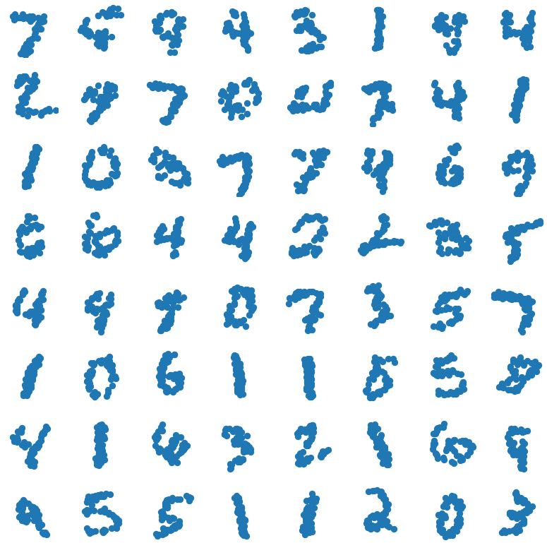
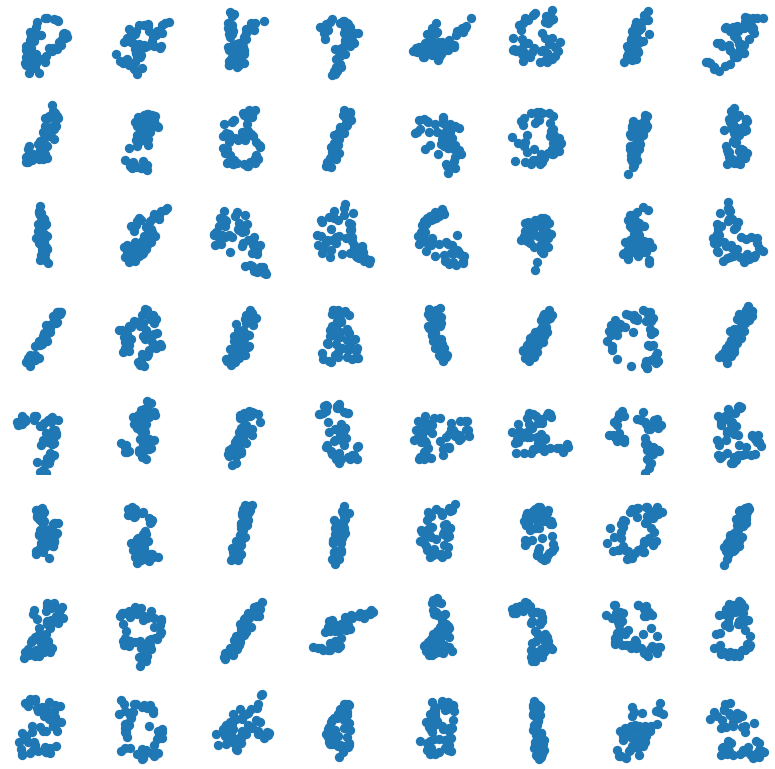
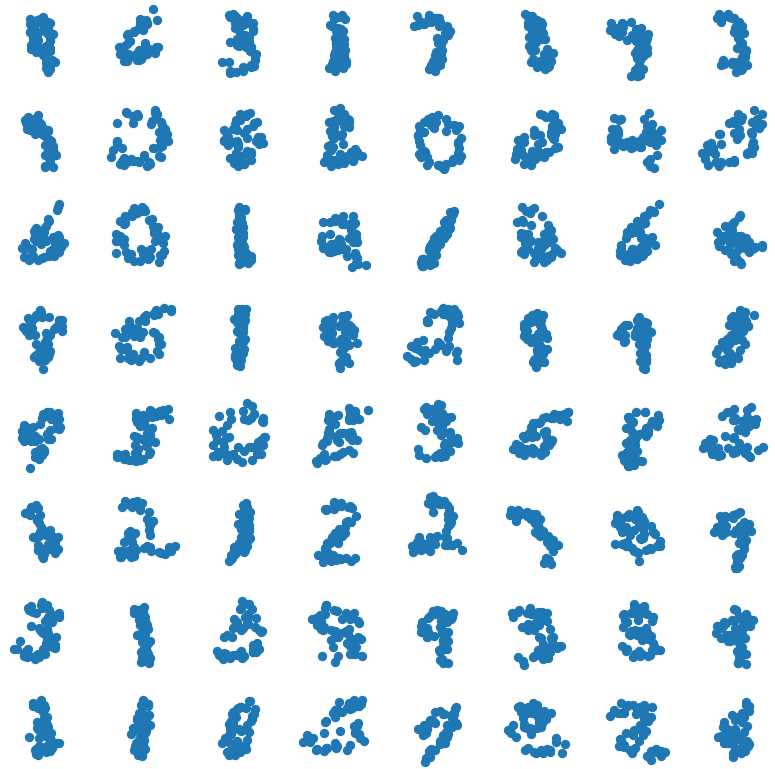

# Point Cloud Experiments

We compare flow models trained trained on the exchangeable SpatialMNIST dataset. In SpatialMNIST, each MNIST digit is represented as a point cloud of 50 points. These 50 points are exchangeable and we therefore seek a model which is permutation invariant. We achieve this by using either a sorting surjection (*SortFlow*) or a stochastic permutation layer (*PermuteFlow*).

Below, we show some samples from the trained models:  
**Left:** *Data*, **Middle:** *SortFlow*, **Right:** *PermuteFlow*.  

  


## Training

We train *SortFlow* and *PermuteFlow* on the SpatialMNIST dataset.
We tuned the dropout rate using the validation set. We considered dropout rates of {0.0, 0.05, 0.1, 0.2, 0.3} for both models.
We found 0.1 to work best for *PermuteFlow*, while 0.2 worked best for *SortFlow*.

#### PermuteFlow
```python
python train_perm_flow.py --epochs 500 --num_flows 32 --warmup 2000 --gamma 0.995 --device cuda --name deepflow_perm
python train_perm_flow.py --epochs 500 --num_flows 32 --warmup 2000 --gamma 0.995 --device cuda --dropout 0.05 --name deepflow_perm005
python train_perm_flow.py --epochs 500 --num_flows 32 --warmup 2000 --gamma 0.995 --device cuda --dropout 0.1 --name deepflow_perm01
python train_perm_flow.py --epochs 500 --num_flows 32 --warmup 2000 --gamma 0.995 --device cuda --dropout 0.2 --name deepflow_perm02
python train_perm_flow.py --epochs 500 --num_flows 32 --warmup 2000 --gamma 0.995 --device cuda --dropout 0.3 --name deepflow_perm03
```

#### SortFlow
```python
python train_sort_flow.py --epochs 500 --num_flows 32 --warmup 2000 --gamma 0.995 --device cuda --name deepflow_sort
python train_sort_flow.py --epochs 500 --num_flows 32 --warmup 2000 --gamma 0.995 --device cuda --dropout 0.05 --name deepflow_sort005
python train_sort_flow.py --epochs 500 --num_flows 32 --warmup 2000 --gamma 0.995 --device cuda --dropout 0.1 --name deepflow_sort01
python train_sort_flow.py --epochs 500 --num_flows 32 --warmup 2000 --gamma 0.995 --device cuda --dropout 0.2 --name deepflow_sort02
python train_sort_flow.py --epochs 500 --num_flows 32 --warmup 2000 --gamma 0.995 --device cuda --dropout 0.3 --name deepflow_sort03
```

## Dataset

To prepare the dataset:
1. Download the raw MNIST dataset from [here](http://yann.lecun.com/exdb/mnist/).
1. Process the dataset using [this code](https://github.com/conormdurkan/neural-statistician/blob/master/spatial/spatialcreate.py).
1. Place the produced files `spatial.pkl` and `labels.pkl` in `DATA_PATH/spatial_mnist/`. The default `DATA_PATH` is `survae_flows/data/` and can be adjusted using:
```python
from survae.data.path import set_data_path
set_data_path(NEW_PATH)
```
