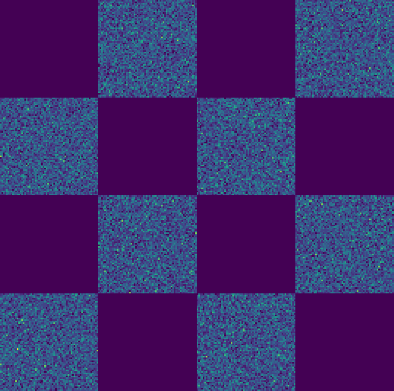
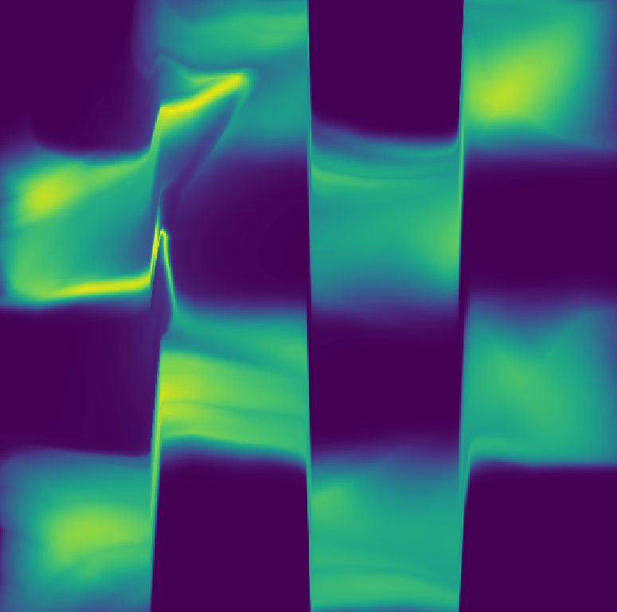
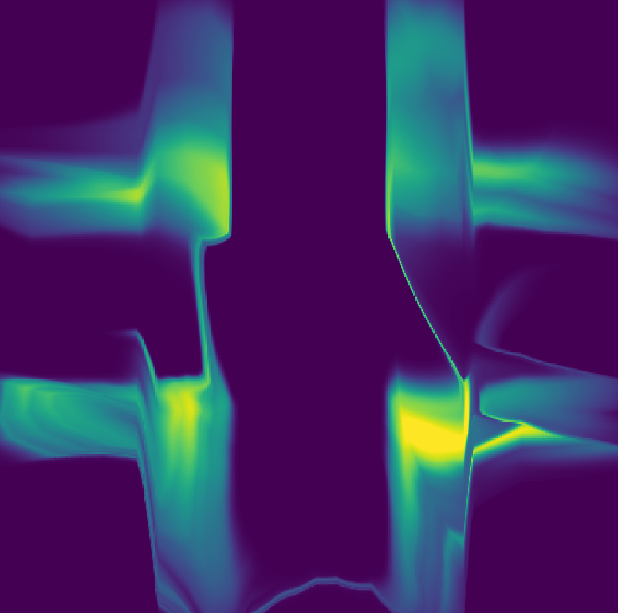
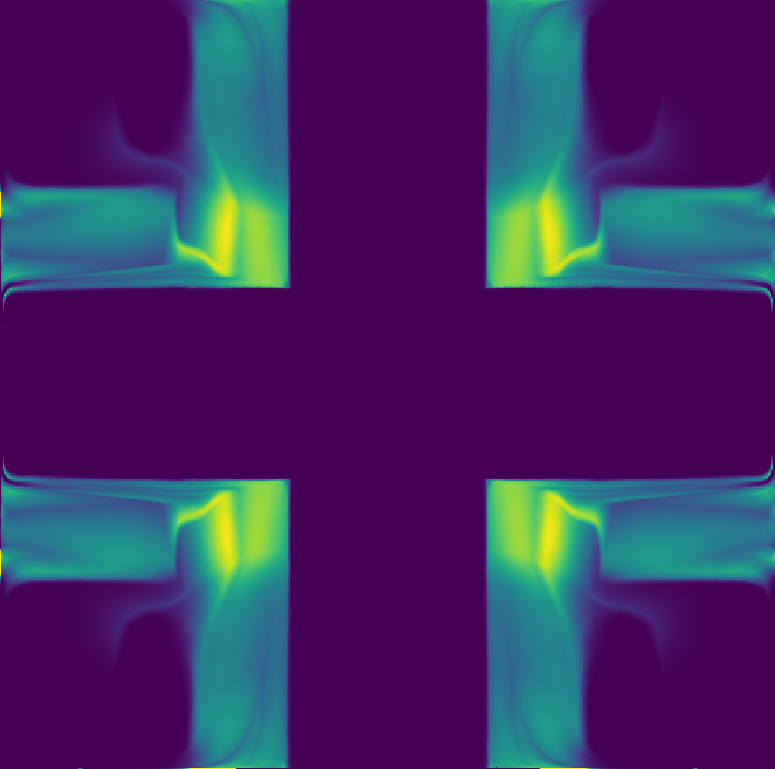
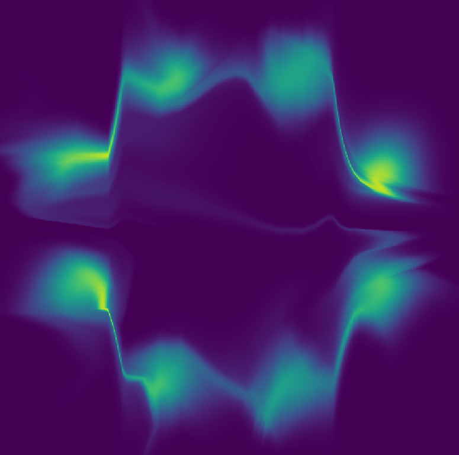

# Toy Experiments

We compare flow models on toy datasets containing symmetries or anti-symmetries. We compare a standard flow model (*Baseline*) to a similar model containing an absolute value surjection (*AbsFlow*). The absolute value surjection is used to enforce known symmetries on the learned density. This leads to improved performance in these cases since it is a good inductive bias.

Below, we compare data samples to the learned densities.  
**Left:** *Data*, **Middle:** *Baseline*, **Right:** *AbsFlow*.  

  

  

  

  

## Training

Commands for `checkerboard`:
```python
python train_flow.py --hidden_units [200,100] --dataset checkerboard --clim 0.05
python train_abs_unif.py --hidden_units [200,100] --dataset checkerboard --clim 0.05
```
Commands for `corners`:
```python
python train_flow.py --hidden_units [200,100] --dataset corners --clim 0.1 --scale_fn softplus
python train_abs_flow.py --hidden_units [200,100] --dataset corners --clim 0.1 --scale_fn softplus
```
Commands for `eight_gaussians`:
```python
python train_flow.py --hidden_units [200,100] --dataset eight_gaussians --clim 0.15 --scale_fn softplus
python train_abs_flow.py --hidden_units [200,100] --dataset eight_gaussians --clim 0.15 --scale_fn softplus
```
Commands for `four_circles`:
```python
python train_flow.py --hidden_units [200,100] --dataset four_circles --clim 0.2 --scale_fn softplus
python train_abs_flow.py --hidden_units [200,100] --dataset four_circles --clim 0.2 --scale_fn softplus
```
